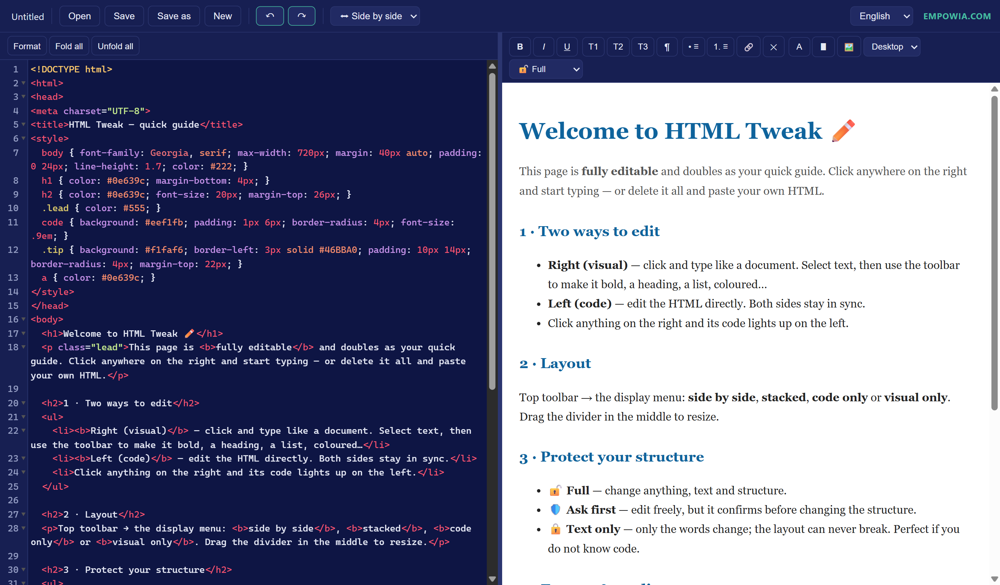

# HTML Tweak

**The simplest, lightest HTML editor — one file, open it in your browser, and tweak any HTML by hand.**

Perfect for fixing up AI-generated pages: instead of chatting back and forth with a chatbot to change a few words, a colour, or the spacing — just open the file and edit it yourself. Visually or in code. **No install. No coding required.**

**[▶ Try it live](https://jinqiuxia.github.io/html-tweak/)** · Made by [Empowia](https://empowia.com)

<!-- Add a screenshot named screenshot.png next to this file, then uncomment: -->
<!--  -->

## Why

AI tools produce HTML all day, but the last-mile tweaks — a wrong word, an off colour, a heading that should be a paragraph — are fiddly to get right by prompting. HTML Tweak lets you (or anyone, even non-coders) grab the file and adjust it directly.

## Features

- **Two ways to edit, always in sync** — edit visually on the right (click and type like a document), or edit the code on the left. Changes flow both ways.
- **Live preview** — see the result as you type.
- **Click-to-locate** — click something on the right, its code lights up on the left.
- **Editing protection** — 🔓 *Full*, 🛡️ *Ask first* (confirm before structural changes), or 🔒 *Text only* (safe for non-coders: change the wording without breaking the layout).
- **Real formatting** — bold / italic / underline, headings, lists, links, text & highlight colours, and image editing (URL / alt / size).
- **Opens & saves real local files** on Chrome / Edge — or download/upload anywhere else.
- **5 languages** — English, 中文, Français, 日本語, Deutsch.
- **One file. No build, no dependencies to install.** Works offline after the first load.

## How to use

**Online:** open the **[live demo](https://jinqiuxia.github.io/html-tweak/)**.

**On your computer:** download **`index.html`** and double-click it (use **Chrome** or **Edge** so it can read & write local files directly).

1. Click **Open** and pick an `.html` file — or paste code on the left.
2. Tweak it — visually on the right, or in code on the left.
3. Click **Save** (`Ctrl+S`).

Pick a **layout** (side-by-side / stacked / code only / visual only) and a **protection** level in the toolbar.

## Notes

- Direct local open/save uses the browser's **File System Access API** — available on **Chrome / Edge** and over **HTTPS**. Elsewhere it falls back to upload + download.
- The editor engine ([CodeMirror](https://codemirror.net/5/)) loads from a CDN on first run, then is cached for offline use.
- It's a single static HTML file — host it anywhere (GitHub Pages, any static host) or just run it locally.

## Contributing

Issues and pull requests are welcome. It's one file (`index.html`) — open it, edit, test in Chrome/Edge, and send a PR.

## License

[MIT](LICENSE) © 2026 Empowia
